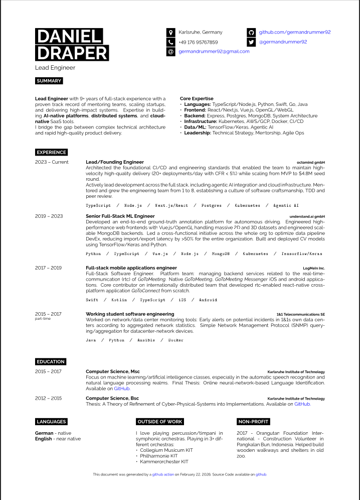

# Resume
[](https://github.com/Germandrummer92/resume/actions/workflows/main.yml)

Personal LaTeX resume based on [latextemplates.com template](https://www.latextemplates.com/template/developer-cv).

## Compiling locally

Make sure you have TeXLive installed:

```bash
sudo apt-get update &&
sudo apt-get install -y --no-install-recommends texlive-latex-base texlive-fonts-recommended texlive-fonts-extra texlive-latex-extra
```

then build using pdfLaTeX:

```bash
pdflatex main.tex
```


## GitHub action

Automatically builds a resume.pdf as a [GitHub action](./.github/workflows/main.yml). 

Latest resume available as an artifact from the latest [action run](https://github.com/Germandrummer92/resume/actions/workflows/main.yml).

## Preview




